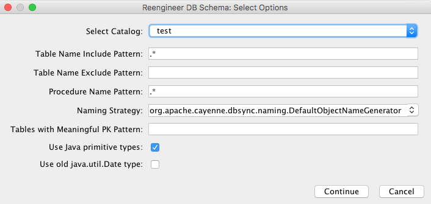

// Licensed to the Apache Software Foundation (ASF) under one or more
// contributor license agreements. See the NOTICE file distributed with
// this work for additional information regarding copyright ownership.
// The ASF licenses this file to you under the Apache License, Version
// 2.0 (the "License"); you may not use this file except in compliance
// with the License. You may obtain a copy of the License at
//
// https://www.apache.org/licenses/LICENSE-2.0 Unless required by
// applicable law or agreed to in writing, software distributed under the
// License is distributed on an "AS IS" BASIS, WITHOUT WARRANTIES OR
// CONDITIONS OF ANY KIND, either express or implied. See the License for
// the specific language governing permissions and limitations under the
// License.

[[re-modeler]]
=== Reverse Engineering in Cayenne Modeler

Alternative approach to using <<re-introduction,build tools>> is doing reverse engineering from <<CayenneModeler Application, CayenneModeler>>.

You can find reverse engineering tool in dataMap view on *DbImport Tab*.

==== Reverse engineering options

Reverse Engineering dialog.

Here is a list of options to tune what will be processed by reverse engineering:

- *Add Catalog*

- *Add Schema*

- *Add Include Table*

- *Add Exclude Table*

- *Add Include Column*

- *Add Exclude Column*

- *Add Include Procedure*

- *Add Exclude Procedure*

- *Tables with Meaningful PK Pattern*: Comma separated list of RegExp's for tables that you want to have meaningful primary keys. By default no meaningful PKs are created.

- *Strip from table names*: Regex that matches the part of the table name that needs to be stripped off generating ObjEntity name.

- *Skip relationships loading*: Whether to load relationships.

- *Skip primary key loading*: Whether to load primary keys.

- *Force datamap catalog*: will set DbEntity catalog to one in the DataMap.

- *Force datamap schema*: will set DbEntity schema to one in the DataMap.

- *Use Java primitive types*: Use primitive types (e.g. *int*) or Object types (e.g. *java.lang.Integer*).

- *Use old java.util.Date type*: Use *java.util.Date* for all columns with *DATE/TIME/TIMESTAMP* types. By default *java.time.* types will be used.

==== DataSource selection

Then you click `Run Import` or `Configure Connection` to set DataSource.
If you don't have any DataSource yet you can create one from this menu.

image::../../images/re-modeler-datasource-select.png[align="center"]

Datasource selection dialog.

Then click `continue` to start dbImport.

