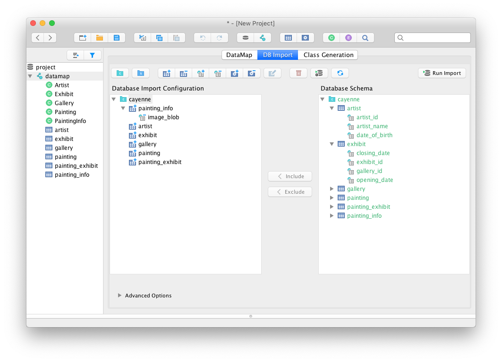

// Licensed to the Apache Software Foundation (ASF) under one or more
// contributor license agreements. See the NOTICE file distributed with
// this work for additional information regarding copyright ownership.
// The ASF licenses this file to you under the Apache License, Version
// 2.0 (the "License"); you may not use this file except in compliance
// with the License. You may obtain a copy of the License at
//
// http://www.apache.org/licenses/LICENSE-2.0 Unless required by
// applicable law or agreed to in writing, software distributed under the
// License is distributed on an "AS IS" BASIS, WITHOUT WARRANTIES OR
// CONDITIONS OF ANY KIND, either express or implied. See the License for
// the specific language governing permissions and limitations under the
// License.
== Java Version

Minimum required JDK version is 1.8 or newer.
Cayenne 4.1 is fully tested with Java 1.8 and 11.

== New Features

=== Cayenne Core is Dependency-Free

Cayenne now depends only on `slf4j-api` library. We removed `velocity`, `commons-lang` and `commons-collections` dependencies from the Cayenne core. Velocity templates replaced with a simplified (and also much faster) parser for the parts of the Velocity syntax essential for Cayenne.

This should be transparent in almost all case. See `UPGRADE.txt` for details.

=== Field-Based Data Objects

Cayenne *4.1* generates field-based DataObjects by default. And it is HUGE for the app performance. The new objects are much faster to read and write and significantly reduce the overall app memory footprint and the corresponding GC pauses.

The new objects are mostly backwards-compatible with our “classic” map-based objects from the application standpoint. The main source of incompatibility is support for “dynamic” properties (i.e. persistent properties not known at compile time).

Field-based DataObjects are generated via new class templates. So to take advantage of this feature you should simply regenerate you model classes.

=== Extensible Project XML Structure

Cayenne mapping project structure was modularized, allowing embedding of extensions with their own XML schemas.
This enables support for comments for entities, attributes and relationships.
Also Cayenne 4.1 have extensions for cdbimport and cgen, making OR modeling workflow experience so much smoother.

== API Changes

=== Transaction propagation logic and isolation level

New API allows to fully control transaction behavior where it's needed.

[source,java]
----
TransactionManager manager = runtime.getInjector().getInstance(TransactionManager.class);
    TransactionDescriptor descriptor = new TransactionDescriptor(
            Connection.TRANSACTION_SERIALIZABLE, // set transaction isolation to SERIALIZABLE
            TransactionPropagation.REQUIRES_NEW  // require new transaction for every operation
    );
    manager.performInTransaction(() -> {
        // perform some DB operations...
        return null;
    }, descriptor);
----

=== Injectable PkGenerator

All `PkGenerators` are now managed by DI so you can simply inject your own implementation.

[source,java]
----
ServerModule.contributePkGenerators(binder)
                .put(MySQLAdapter.class.getName(), CustomSQLPkGenerator.class);
----

=== DataChannelFilter replaced with DataChannelQueryFilter and DataChannelSyncFilter

`DataChannelFilter` is deprecated. Instead two separate filters are introduced.

[source,java]
----
ServerModule.contributeDomainQueryFilters(binder).add((context, query, chain) -> {
    // do something with query
    // ...
    return chain.onQuery(context, query);
});

ServerModule.contributeDomainSyncFilters(binder).add((context, changes, syncType, chain) -> {
    // do something with changes
    // ...
    return chain.onSync(context, changes, syncType);
});
----