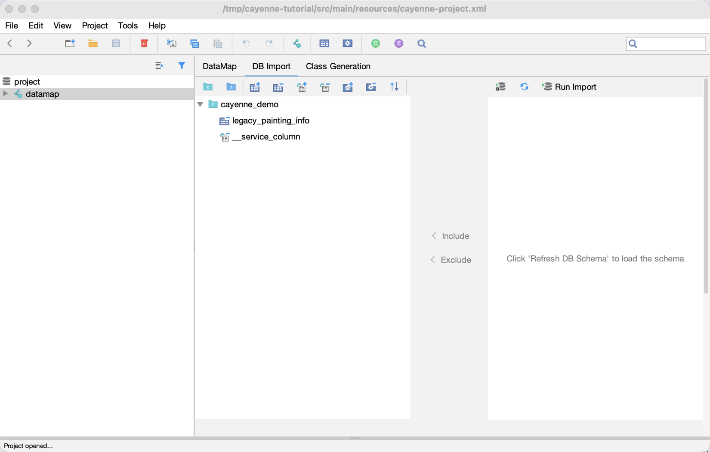
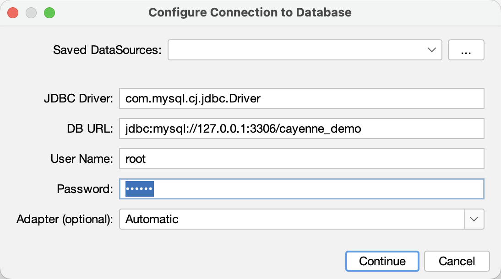

// Licensed to the Apache Software Foundation (ASF) under one or more
// contributor license agreements. See the NOTICE file distributed with
// this work for additional information regarding copyright ownership.
// The ASF licenses this file to you under the Apache License, Version
// 2.0 (the "License"); you may not use this file except in compliance
// with the License. You may obtain a copy of the License at
//
// https://www.apache.org/licenses/LICENSE-2.0 Unless required by
// applicable law or agreed to in writing, software distributed under the
// License is distributed on an "AS IS" BASIS, WITHOUT WARRANTIES OR
// CONDITIONS OF ANY KIND, either express or implied. See the License for
// the specific language governing permissions and limitations under the
// License.

[[re-modeler]]
=== Reverse Engineering in Cayenne Modeler

Alternative approach to using <<re-introduction,build tools>> is doing reverse engineering from CayenneModeler.

You can find the reverse engineering tool on the *DB Import* tab of a DataMap.

==== Reverse engineering options

DB Import tab.

Here is a list of options to tune what will be processed by reverse engineering:

- *Add Catalog*

- *Add Schema*

- *Include Table*

- *Exclude Table*

- *Include Column*

- *Exclude Column*

- *Include Procedure*

- *Exclude Procedure*

More options are available after clicking *Advanced Options*:

- *Naming Strategy*: A strategy that generates the names of ObjEntities, attributes and relationships.

- *Meaningful PK*: Comma separated list of RegExp's for tables that you want to have meaningful primary keys. By default no meaningful PKs are created.

- *Strip From Table Names*: Regex that matches the part of the table name that needs to be stripped off generating ObjEntity name.

- *Table Types*: Table types to import. By default these are TABLE and VIEW.

- *Skip Relationships*: Whether to load relationships.

- *Skip Primary Keys*: Whether to load primary keys.

- *Force DataMap Catalog*: will set DbEntity catalog to one in the DataMap.

- *Force DataMap Schema*: will set DbEntity schema to one in the DataMap.

- *Use Java 7 Types*: Use *java.util.Date* for all columns with *DATE/TIME/TIMESTAMP* types. By default *java.time.* types will be used.

==== DataSource selection

Click `Configure Connection` to set a DataSource (`Run Import` would also ask for it, if there is none yet).
You can pick one of the saved DataSources, or enter the connection settings right in the dialog.

DataSource configuration dialog.

Then click `Continue`. Once the connection is configured, `Run Import` starts the import.

