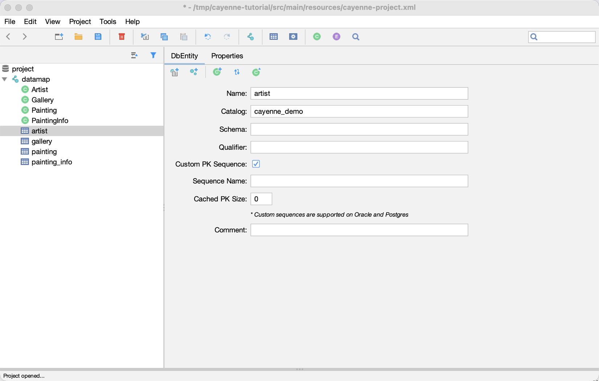

// Licensed to the Apache Software Foundation (ASF) under one or more
// contributor license agreements. See the NOTICE file distributed with
// this work for additional information regarding copyright ownership.
// The ASF licenses this file to you under the Apache License, Version
// 2.0 (the "License"); you may not use this file except in compliance
// with the License. You may obtain a copy of the License at
//
// https://www.apache.org/licenses/LICENSE-2.0 Unless required by
// applicable law or agreed to in writing, software distributed under the
// License is distributed on an "AS IS" BASIS, WITHOUT WARRANTIES OR
// CONDITIONS OF ANY KIND, either express or implied. See the License for
// the specific language governing permissions and limitations under the
// License.

=== Modeling Primary Key Generation Strategy

Cayenne supports three PK generation strategies:

1. *Cayenne Generated*.
This is default strategy. Cayenne will use special table `AUTO_PK_SUPPORT` (or the DB sequences on the databases that support them) for managing primary keys.

2. *Database Generated*.
Cayenne will delegate PK generation to database (e.g. auto increment fields on MySQL or `serial` type on PostgreSQL).
To use it, check "Auto-Increment" for the PK column on the "Properties" tab of a DbEntity.

3. *Custom Sequence*. In this case Cayenne will use provided sequence to generate primary keys.
To use it, check "Custom PK Sequence" on the "DbEntity" tab and enter the sequence name. Custom sequences are supported on Oracle and PostgreSQL.

Strategy should be set per each `DbEntity` independently.

